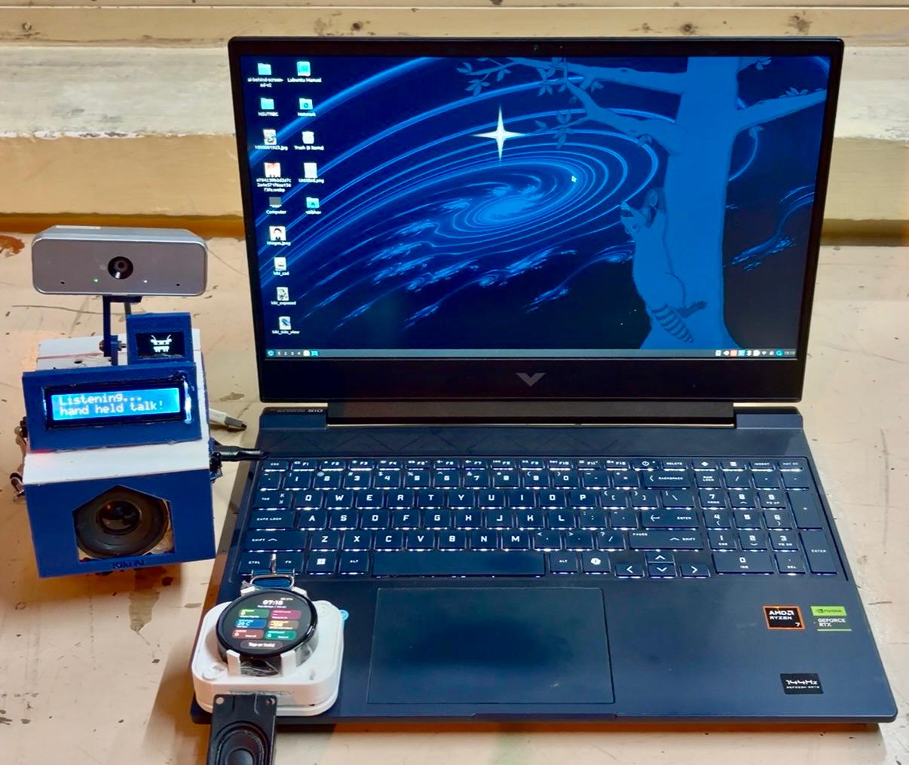
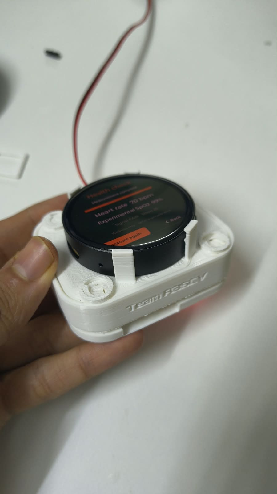
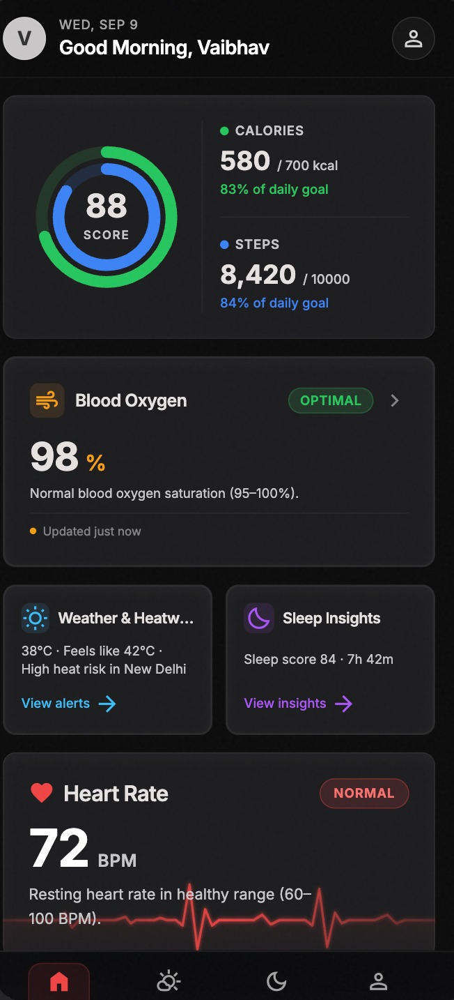
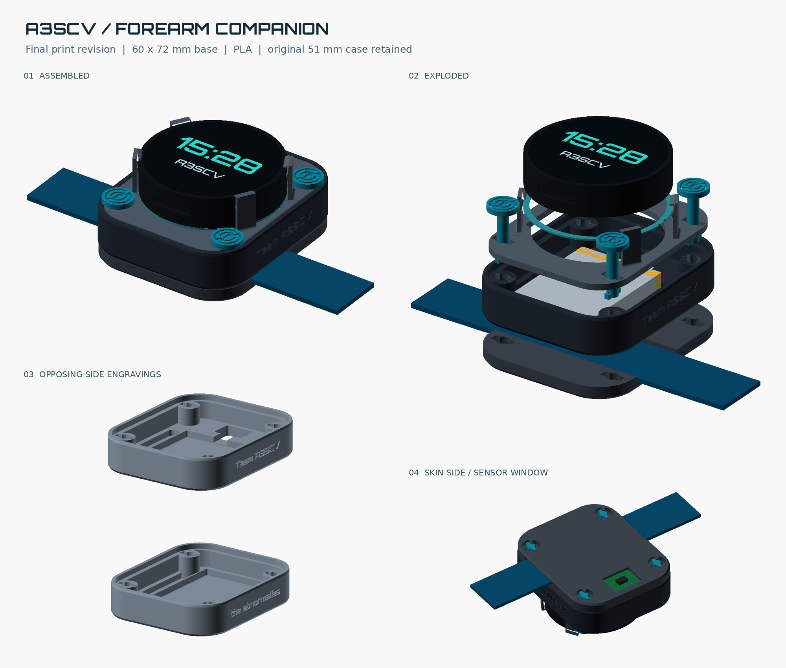

# Kiki Health Companion

**SIH 2026 · PS 26181 · Hardware · MedTech / BioTech / HealthTech**

  

A desktop companion and a wearable, built around the same idea: continuous, privacy-preserving, voice-first health monitoring that keeps working when the internet doesn't.

## Table of Contents

- [Project Information](#project-information)
- [Problem Statement](#problem-statement)
- [Proposed Solution](#proposed-solution)
- [Key Features](#key-features-mapped-to-problem-statement)
- [Impact](#impact)
- [Hardware and Software](#hardware-and-software)
- [Architecture](#architecture)
- [Run It](#run-it)
- [Code and Build Files](#code-and-build-files)
- [What's Left](#whats-left)
- [Future Scope](#future-scope)

---

## Project Information

- **Project Title:** Kiki Health Companion
- **PS ID:** 26181
- **PS Title:** A secure, AI-powered Personal Health Companion that delivers real-time, privacy-preserving health monitoring and early warning capabilities, helping individuals recognize health risks before they become emergencies. The solution should improve resilience during heat waves, floods, pollution events, and other disasters common in India while enabling continuous health support through on-device intelligence.
- **Category:** Hardware
- **Theme:** MedTech / BioTech / HealthTech
- **Team:**  Team Abnormalies, NSUT
  - Suyash Srivastava — Team Lead, Hardware & CAD Design
  - Vaibhav Arora — Systems Architecture, AI & Voice Pipeline
  - Aditi Sharma — Backend Engineering & Database 
  - Chirag Goel — Technical Research, Pitch & Video Production
  - Aniket Sharma — Frontend Development & UI/UX Lead 
  - Aavya — Documentation, Web UI & Testing


## Problem Statement

India faces recurring health crises during heat waves, floods, pollution events, and disease outbreaks. Vulnerable groups — elderly, outdoor workers, chronic patients — lack continuous, privacy-preserving health monitoring that works offline. The problem demands a secure, AI-powered Personal Health Companion that:

- Monitors heart rate, SpO₂, activity, sleep, and environmental conditions
- Detects anomalies on-device (heat stress, dehydration, falls, respiratory distress)
- Provides actionable alerts and emergency assistance
- Preserves privacy and operates without internet
- Supports voice-first interaction for low-literacy users

**Kiki Health Companion directly addresses all of these.**

## Proposed Solution

Kiki is a desktop companion and a wearable built around the same idea. The desktop stays in the room and handles conversation, reminders, measures ambient temperature/pressure and camera-based activity checks. The wearable goes with the person and handles steps, on-demand heart rate, and possible falls.



A health reminder is more useful when it fits the person's day. Kiki keeps routines and recent observations together, so someone can talk through a reminder or an exercise instead of working through an app. Voice interaction supports English and Hindi.

The desktop has a camera for activity detection, face recognition, and exercise checks. The wearable uses wrist motion, with fall detection running in firmware. If it detects a possible fall, it gives the wearer time to respond before requesting a family alert through the gateway.

Both devices use a laptop for speech recognition, speech generation, and the local conversation model. Some reasoning runs through cloud services. Local speech processing and firmware fall detection don't need internet, but the devices still need access to the laptop for conversation. Weather updates, cloud agents, and WhatsApp/email alerts need connectivity.



## Key Features (Mapped to Problem Statement)

Every row below is implemented and running, not planned:

| PS Requirement | Kiki Implementation |
|----------------|---------------------|
| Continuous health monitoring | On-demand HR/SpO₂, steps, wear detection, activity checks |
| AI-based anomaly detection | Rule-based + ML (edge) for falls, elevated HR, fatigue |
| Disaster-specific alerts | Weather API + estimated AQI, heat index warnings |
| Environmental awareness | Open-Meteo API, stale readings flagged |
| Privacy-preserving edge AI | All raw health data stays on device; only alerts transmitted |
| Emergency assistance | Fall detection → voice check → family alert via gateway |
| Wellness dashboard | Web dashboard + mobile app UI |
| Voice-first accessibility | English and Hindi voice interface, no screen literacy needed |
| Offline capability | Firmware fall detection works without internet |



*Live dashboard capture — note the "High heat risk in New Delhi" card. This is the disaster-resilience requirement rendered as an actual running feature, not a mockup.*

## Impact

Kiki targets exactly the groups the PS names as underserved: elderly citizens, outdoor workers, and people with chronic conditions — the people least likely to have continuous monitoring today, because existing wearables assume connectivity, English literacy, and a willingness to read an app.

- **Social:** voice-first interaction removes the literacy and smartphone-comfort barrier that shuts many people out of existing health apps.
- **Safety:** on-device fall detection and heat/AQI alerts work whether or not the internet does, which matters most exactly when infrastructure is stressed during a disaster.
- **Economic:** built on open-source software and commodity hardware, meaningfully cheaper than commercial continuous-monitoring wearables.
- **Trust:** the system is explicit about what it doesn't know yet — see [What's Left](#whats-left) — rather than presenting unvalidated readings as medical fact.

## Hardware and Software

| Part | Current setup |
|---|---|
| Desktop | Raspberry Pi 5, Hailo-8 vision accelerator, USB webcam, 28BYJ-48 stepper, LCD and OLED displays, IR controls, Bluetooth speaker |
| Wearable | Waveshare ESP32-S3-Touch-AMOLED-1.75, MAX30102, QMI8658 IMU, microphones and speaker, 1000 mAh battery |
| Inference laptop | RTX 4060, llama.cpp with gemma-4-26B-A4B, whisper.cpp and OmniVoice |
| Device software | Python desktop module and WebSocket gateway; C++ firmware on ESP-IDF 5.5 |
| Cloud services | Cerebras for multi-step agents, Gemini for background reasoning |
| Analytics | Python, pandas and NumPy; Next.js/TypeScript dashboard with SQLite; optional TFLite experiment |

## Architecture



The Pi and wearable handle the physical inputs and outputs. The laptop runs inference and the wearable gateway. Our setup connects the machines through Tailscale. The local model has one inference slot, so background work must leave it available when someone speaks.

See [docs/architecture.md](docs/architecture.md) for the high-level data flow diagram, and the [engineering notes](docs/ENGINEERING.md) for the full technical detail — wiring, audio, latency, and the failures that shaped the build.

## Run It

These commands start from the repository root, in separate terminals for each component. You'll need the hardware for the full demo, Python 3.12+ for the gateway, and ESP-IDF 5.5 for firmware builds. The model, speech, and hardware services need to be set up separately; installing the Python packages doesn't start them.

There's no single root `requirements.txt` — this is a multi-component system (desktop, gateway, firmware), so each component manages its own dependencies. Each is installed separately below.

**Desktop, on the Pi**

```bash
cd src/desktop-module
python3 -m venv .venv
source .venv/bin/activate
pip install -r requirements.txt
cp .env.example .env
cp tools_and_config/config.example.json tools_and_config/config.json
# Set API keys and update service addresses for your machines.
python main.py
```

**Gateway, on the laptop**

```bash
cd src/wearable
python3.12 -m venv .venv
source .venv/bin/activate
pip install -e gateway
cp gateway.env.example gateway.env
# Set the gateway token, inference URLs and shared care-plan paths.
./scripts/run_gateway.sh
```

**Wearable firmware**, from a shell with ESP-IDF loaded:

```bash
cd src/wearable/firmware
idf.py set-target esp32s3
idf.py menuconfig
# Set Wi-Fi, gateway address and the matching gateway token.
idf.py build
idf.py -p /dev/ttyACM0 flash monitor
```

Change the serial port if your board appears elsewhere. More deployment details are in [docs/wearable/DEPLOY.md](docs/wearable/DEPLOY.md). Keep credentials in your local configuration files.

## Code and Build Files

| Location | Contents |
|---|---|
| [src/](src/README.md) | Code map, test commands and analytics setup |
| [docs/architecture.md](docs/architecture.md) | High-level system diagram |
| [docs/ENGINEERING.md](docs/ENGINEERING.md) | Technical notes and known limits |
| [docs/data/](docs/data/) | Captured system output and analytics sample |
| [assets/hardware/](assets/hardware/) | Build photos |
| [assets/circuit_diagram/](assets/circuit_diagram/) | Wiring diagrams and Fritzing sources |
| [assets/CAD_model/](assets/CAD_model/) | Enclosure source, renders and print files |
| [submission/PRESENTATION.md](submission/PRESENTATION.md) | Presentation details |
| [submission/DEMO.md](submission/DEMO.md) | Demo details |

## What's Left

Fall detection uses heuristic thresholds. We've tried it during development, but controlled physical acceptance testing and clinical validation are still pending. The MAX30102's SpO₂ estimate is uncalibrated and isn't treated as a health reading, even though an early prototype photo shows it on the display.

## Future Scope

- Continuous wrist SpO₂ with improved motion artifact removal
- Body temperature sensor integration (non-contact)
- GPS location for outdoor emergency response
- Automatic sleep quality analysis
- Multi-language support beyond Hindi/English
- Clinical validation and CDSCO certification
