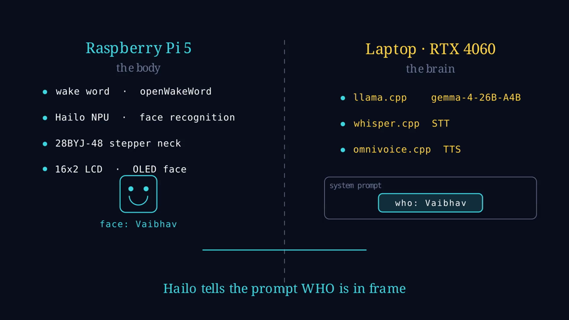
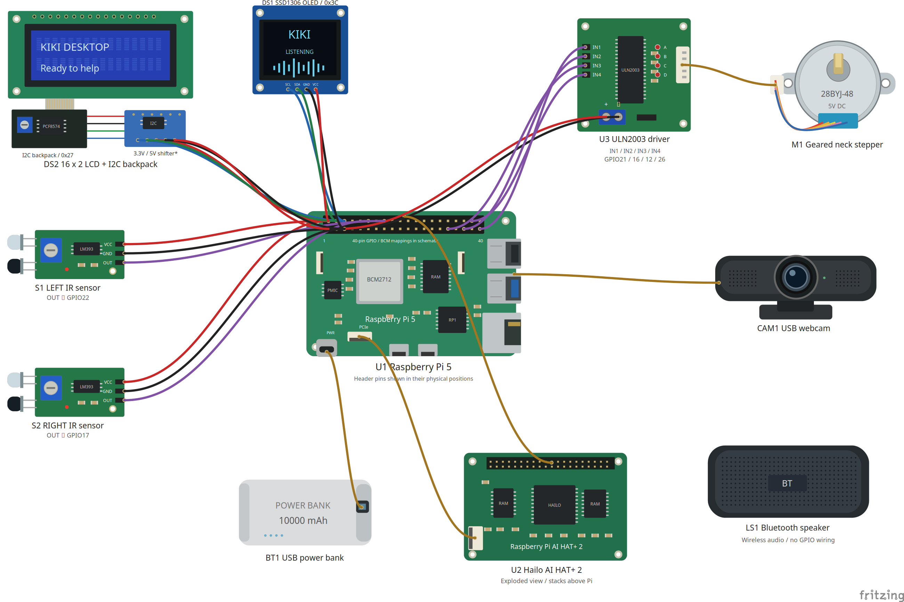
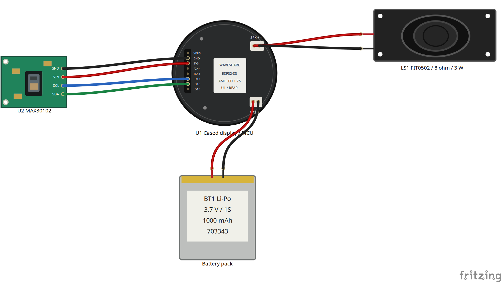

# Kiki engineering notes

This covers the desktop and wearable build as of 8 September 2026. Project details and setup commands are in the [README](../README.md); this file keeps the hardware choices, software constraints and debugging notes that are useful when working on it.

## How the system fits together

The Raspberry Pi 5 handles the desktop's camera, controls, displays and motor. The ESP32-S3 handles the watch. A laptop with an RTX 4060 runs the local model and speech services, with the machines connected through Tailscale.

| Laptop service | Port |
|---|---|
| llama.cpp | 8080 |
| OmniVoice TTS | 8082 |
| whisper.cpp | 5555 |
| Wearable gateway | 8765 |

The local conversational model is `gemma-4-26B-A4B`. It runs with `-np 1`, giving it one inference slot. Foreground conversation gets priority because waiting behind a background generation makes the device feel unresponsive.

Cerebras handles multi-step agent work, while Gemini handles background reasoning. The background process can save context for later conversations, but it can't move the robot or independently send messages. Speech recognition and the ambient buffer stay on our hardware; reasoning over that context can involve a cloud call.

The model's expert offload setting is `--n-cpu-moe 30`. Most expert tensors stay in system memory, keeping the measured VRAM use around 5 GB. The mixture-of-experts model reduces active computation per token, but that alone doesn't make all the weights fit in VRAM.

### Keeping conversation fast

Our live-server prefill test, `tests_llamaserver/test_prefill_e2e.py`, measured **24.0 seconds cold** and **1.26 seconds warm**. These are measurements from our setup, not a promise for every reply.

The difference came from preserving the conversation prefix in llama.cpp's KV cache. Editing an earlier message forces the server to process context again. We had a timestamp in `message[1]` that changed every five minutes; that small edit caused recurring cold starts.

The client now keeps old messages unchanged and stores assistant output exactly as generated, including `<neck:>`, `<oled:>` and `<tool_call>` tags. Warmup happens after the final context is assembled. If another request disturbs the local cache, the foreground conversation needs warming again.

Speech also starts before the whole reply is finished. Each completed sentence goes to TTS while the model generates the next one.

## Hardware

### Desktop

| Part | Connection or setting |
|---|---|
| Compute and vision | Raspberry Pi 5, Hailo-8 accelerator, USB webcam |
| Camera stream | MJPEG on `localhost:5000` |
| Neck motor | 28BYJ-48 through ULN2003; GPIO 21, 16, 12, 26 |
| Front controls | Active-low LM393 IR sensors; left GPIO 22, right GPIO 17 |
| Character display | 16×2 LCD with PCF8574, I²C address `0x27` |
| Face display | 128×64 SSD1306 OLED, I²C address `0x3c` |
| Audio | Clavier One Bluetooth speaker |
| Power | 10,000 mAh USB bank; CPU capped at 2200 MHz |

A printed gear pair trades motor speed for torque to turn the head. The IR controls handle push-to-talk, return-to-idle and settings. Both displays share I²C bus 1, protected by one process-wide lock.

We lowered the CPU clock after power problems under combined load. A 1 Hz flight recorder now records system state to help distinguish brownouts from thermal shutdowns or software crashes.

### Wearable

| Part | Connection or setting |
|---|---|
| Board | Waveshare ESP32-S3-Touch-AMOLED-1.75; 466×466 touch display, 8 MB PSRAM |
| Heart-rate sensor | MAX30102; separate I²C bus, SDA GPIO 18, SCL GPIO 17, address `0x57`, 25 kHz |
| Motion | QMI8658 at 8 g / 1024 dps, sampled at 50 Hz |
| Audio input | Two microphones through ES7210 |
| Playback | ES8311 codec, NS4150B amplifier, 8 Ω 3 W speaker |
| Power | AXP2101 and a 1S 3.7 V, 1000 mAh cell |
| Firmware | C++, ESP-IDF 5.5 |

Internal RAM was tighter than CPU time. The linker reported 341,760 bytes of DIRAM, with roughly 166 KiB left after static allocation. Meanwhile, most of the 8 MB PSRAM was unused.

Moving the 66 KiB microphone queue and transmit/receive buffers to PSRAM raised free internal RAM from about 19 KiB to 84 KiB. The largest DMA-capable block grew from 7–12 KiB to 31 KiB, which made runtime allocation much less fragile.

The PLA enclosure uses a 60 × 72 mm base and holds the display module in its original 51 mm factory case. We changed to this arrangement after the AMOLED separated from the board during removal on 27 August. Four printed tabs now hold the case without pressing on the bare bezel.

A CAD review also caught tight wall clearances, an impractical detent and a font fallback before printing. Dimension assertions now catch some of those mistakes during regeneration. A custom PCB was postponed so we could finish the development-board version.

## Wearable audio and connection fixes

Raw 48 kHz, 16-bit mono audio needs 768 kbps in each direction. Our phone-hotspot/public-tunnel path only managed about 396 kbps. One run delivered just 74 of 3,449 microphone frames, with 16.5 seconds of playback gaps across a few replies.

Microphone audio now uses 16 kHz. Playback can use 48 kHz PCM on LAN, 16 kHz PCM remotely, or Opus at around 32 kbps. In the follow-up run, microphone frame loss was zero, playback underruns fell from 51 to 2, and total gaps dropped from 16,560 ms to 120 ms.

The playback start buffer stays at 100 ms. For more jitter tolerance, the gateway sends farther ahead instead of making the watch wait longer before speaking.

Two bugs took longer to find than the bandwidth issue:

- **WebSocket keepalive timeouts.** Sessions died even on a strong home Wi-Fi connection with no radio disconnects. `esp_websocket_client` shared a lock across sends, reads and keepalive pings, so a slow send could block the ping. One task now owns the socket, with other tasks feeding priority queues. The slowest LAN write measured afterwards was 2 ms.
- **Missing Opus audio.** Our binary parser rejected odd-length payloads, a check left over from 16-bit PCM. Opus packets can have odd lengths, so valid packets disappeared before reaching the decoder. The clue was a rate-limited `bad binary frame (33 bytes)` log. The parser needed to validate according to codec.

## Readings and fall alerts

Weather and air-quality data come from Open-Meteo. AQI is calculated from the latest hourly particulate values using CPCB breakpoints. It is an estimate on that scale, not an official station AQI based on the full averaging period and pollutant set.

Environmental snapshots are fresh for 30 minutes, stale until two hours, then unavailable. Unavailable snapshots omit environmental numbers so downstream code can't accidentally quote an old value. Failed pollutant fetches leave those fields empty rather than filling in a guess. A captured response is in [data/environment.snapshot.json](data/environment.snapshot.json).

Heat banding uses apparent temperature. Heart-rate storage accepts only GOOD or FAIR signal quality; a failed attempt can still be logged without saving its number as a trusted reading. SpO₂ is experimental and uncalibrated. It has a separate field and isn't treated as a health reading, despite appearing on an early prototype display.

### Fall detection

The detector runs in firmware over 50 Hz IMU samples. It requires:

1. Recent evidence that the watch is being worn.
2. At least 80 ms below 0.55 g.
3. An impact of at least 2.3 g within the next second.
4. Eight seconds of relative stillness.
5. A 30-second check-in before requesting an alert.

Candidates expire after 20 seconds, and a 60-second cooldown limits repeated alerts. Small movements after impact don't immediately cancel a candidate; a deliberate touch or spoken response does. Unworn drops are ignored.

These thresholds are heuristic. Controlled physical acceptance testing and clinical validation haven't been completed. Firmware detection works without a network, but sending a family alert requires the gateway and messaging service.

The [care-plan excerpt](data/care_plan.excerpt.json) includes a possible-fall request and its delivery record. `accepted: true` means the messaging tool accepted the send; `delivery_confirmed: false` means delivery wasn't confirmed. Neither says that someone read the message or that emergency services were dispatched.

## Camera activity checks

CLIP proposes activities on the desktop. An observation then passes through prompt geometry, margin/persistence, physical plausibility, vision-model adjudication and relevance checks before entering the care log.

The current prompt set has 11 positive activities and 17 negative distractors. Descriptions of visible movement worked better than inferred outcomes: “raising a cup or bottle to their mouth” was more useful than “drinking water”. The vision model gets an open question about the scene, and unclear answers or failed calls reject the candidate.

We removed the `unsteady` activity after it fired nine times in ten minutes on a healthy person. A single frame couldn't reliably distinguish steadying against a wall from standing beside one. Camera activity events aren't used for fall detection.

Accepted observations retain the vision model's wording in the care log. They're still observations, not proof that medicine was swallowed or an exercise was performed correctly.

## Care sessions

`care_plan.json` holds the profile, routines, family contacts, care log, session history and trusted readings. A routine supplies a `session_brief` describing its purpose; the care agent handles the conversation around it. That leaves room for someone to say their knee hurts or ask to stop.

Sessions end through a spoken stop request, an idle timeout or a turn limit (40 by default). We added these after a session appeared finished but stayed open internally for about twenty minutes, blocking other routines.

Hindi stop requests need explicit transliteration handling. Whisper once transcribed `बस` as `bus`, which the model interpreted as “just” and used to continue. Ordinary negative answers such as “no” or “नहीं” aren't global stop commands, since they can simply answer a question about symptoms.

Tool results determine whether an action can be reported as done. The same applies to session status: a cancelled interaction stays cancelled, and a session interrupted by a process restart is marked abandoned. It doesn't silently become completed.

## Checks and remaining work

Recorded test results from 8 September 2026:

| Suite | Result | Time |
|---|---|---|
| Desktop Python tests | 1,101 passed, 2 warnings | 26.96 s |
| Wearable gateway tests | 538 passed | 15.57 s |

These suites run without hardware or inference services. Firmware also has host-compiled tests for the protocol parser, motion classifier, panel state, transmit priority, IMU wire format and known Wi-Fi networks. Commands are in [src/README.md](../src/README.md).

The running system had ingested 209 telemetry batches and recorded 18 possible-fall alerts by that snapshot. Those counts describe development use; they don't measure detection accuracy.

The analytics pipeline currently uses generated data, and the caregiver dashboard has a separate SQLite database. Connecting both to `/api/care/v1` is unfinished. The TFLite experiment is separate from firmware fall detection. Sleep remains voice-logged, and SpO₂ still needs calibration and validation before it can be used as a health reading.

Build photos, circuit sources and CAD files are under [assets/](../assets/). The ₹1,110 sensor purchase was only part of the build cost. Our wearable BOM target is roughly ₹4,000–5,000; it isn't a verified production cost.
