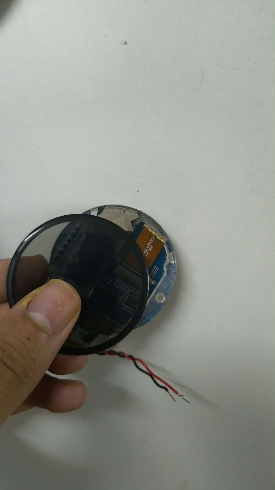
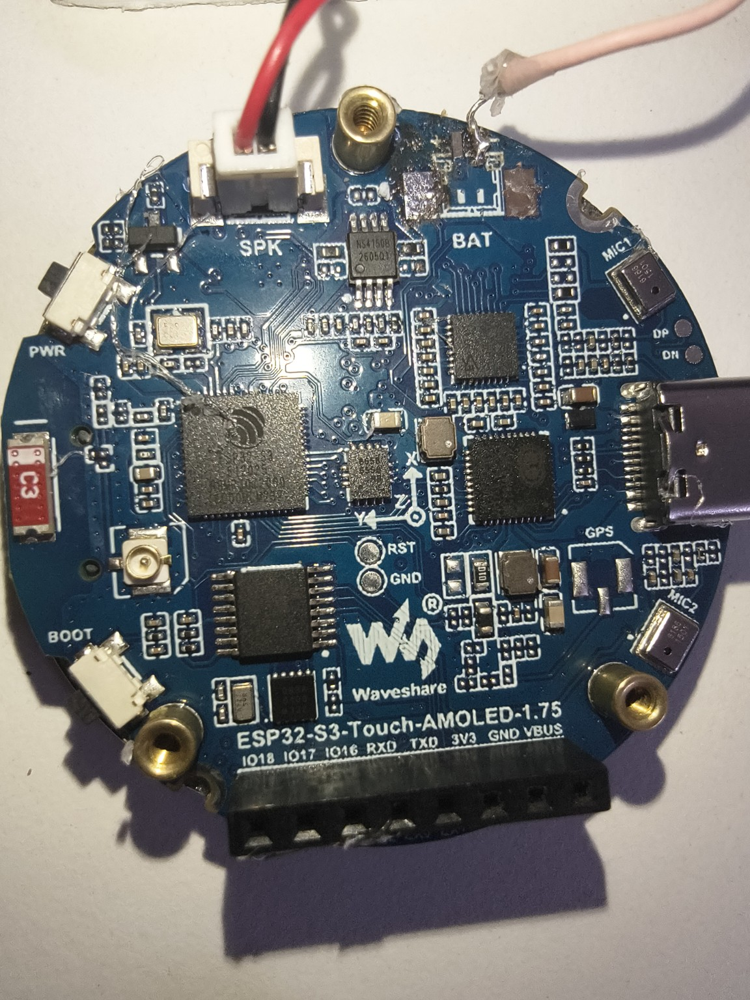
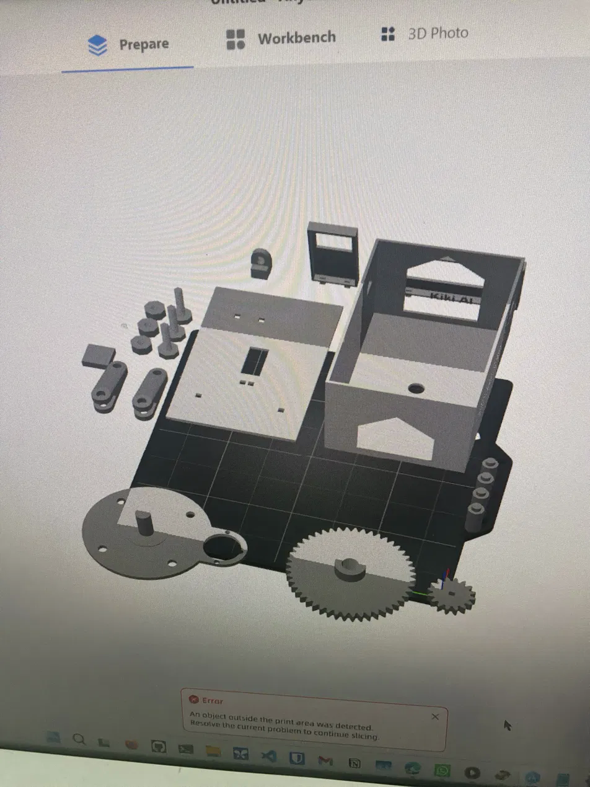
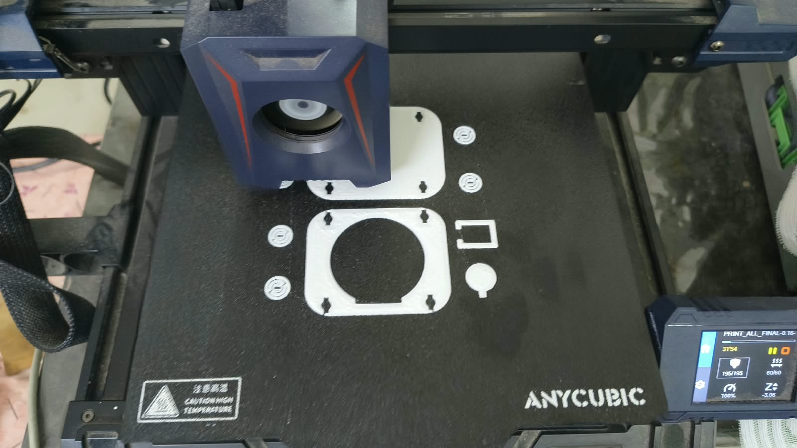

# PS 26181 — Personal Health Companion

We are building this for PS 26181, **“A secure, AI-powered Personal Health Companion”**, under the Hardware / MedTech / BioTech / HealthTech track.

Our team is **A3SCV (Team Abnormalies)** from NSUT. There are six of us: Vaibhav Arora, Suyash Srivastava, Aniket Sharma, Chirag Goel, Aditi Sharma and Aavya. Suyash is the team lead.

The team came together on 19 August 2026 and the submission deadline is 10 September, so most of the system has been built in a fairly short window. More than 270 teams registered at the NSUT level.

The project ended up becoming two devices rather than one.

There is a desktop companion that stays in the person's room, and a wearable that goes with them outside. They aren't meant to behave like two separate products though. Both use the same care plan, the same care agent and the same conversation history.

The easiest way to think about it is that they are two bodies for the same companion.

---

**Contents**

- [What the two devices actually do](#what-the-two-devices-actually-do)
- [System architecture](#system-architecture)
- [The KV-cache problem, which turned into most of the latency work](#the-kv-cache-problem-which-turned-into-most-of-the-latency-work)
- [Desktop hardware](#desktop-hardware)
- [Wearable hardware](#wearable-hardware)
- [Getting audio to and from the wearable](#getting-audio-to-and-from-the-wearable)
- [Weather, air quality and health data](#weather-air-quality-and-health-data)
- [Fall detection](#fall-detection)
- [CLIP activity detection](#clip-activity-detection)
- [Care plan and care sessions](#care-plan-and-care-sessions)
- [Cost so far](#cost-so-far)
- [How much of this has actually been tested](#how-much-of-this-has-actually-been-tested)
- [Things that broke](#things-that-broke)
- [The point where we almost dropped the wearable](#the-point-where-we-almost-dropped-the-wearable)
- [Plugin architecture](#plugin-architecture)

The live captures referenced through this document are in [`data/`](data/).

---

## What the two devices actually do

The **desktop unit** is the more capable one visually because it has a camera. It handles CLIP-based activity detection, exercise coaching where a vision model checks what the person is actually doing, face recognition, care-plan scheduling and normal conversation. It can also reach family or other contacts through WhatsApp and email when the relevant tools are used.

The **wearable** has no camera at all.

Instead, wrist movement from its IMU becomes another source of evidence for the care system. It handles things that make more sense on the wrist anyway: fall detection, step counting, wear detection, on-demand heart-rate readings and the on-watch dashboard.

Both ultimately connect through the same gateway running on the laptop.

---

## System architecture

There are basically three computers involved.

The Raspberry Pi 5 is the body of the desktop robot. The ESP32-S3 is the body of the wearable. Then there is a laptop with an RTX 4060, which does almost everything that would qualify as "thinking".

The laptop currently runs:

* `llama.cpp` on port `8080`
* OmniVoice TTS on `8082`
* `whisper.cpp` on `5555`
* the ESP32 gateway on `8765`

The local conversational model is **gemma-4-26B-A4B**.

All three machines are connected using Tailscale. There is no normal port forwarding involved, and the ordinary voice path doesn't need to bounce through a cloud server first.

One slightly unusual design decision is that `llama-server` runs with `-np 1`.

So there is exactly one inference slot.

That sounds restrictive, and it is, but it is intentional. A large part of the client architecture exists specifically to keep that one slot available for foreground speech. When someone speaks to the companion, we don't want some background process to already be halfway through a long local generation.

The Gemma model has about 26 billion total parameters, but it is mixture-of-experts and only around 4B parameters are active for a token.

The reason it can run with roughly 5 GB of VRAM isn't simply "because MoE uses 4B parameters". Sparsity cuts compute, not memory.

The actual setup uses:

`--n-cpu-moe 30`

which keeps most of the expert tensors in system memory rather than VRAM. The MoE architecture is what makes that kind of offload practical enough to use, but the offload itself is what keeps VRAM usage down.

There are also multiple models because trying to make one model do absolutely everything turned out to be a bad architecture.

Local Gemma handles normal conversation.

A Cerebras-backed agent handles jobs that require more involved multi-step work.

The care agent handles actual care sessions.

And then there is a cloud-only background process that we usually call the **idle mind**. It runs between conversations and writes thoughts/context for later use.

That process is deliberately cloud-only. It can never occupy the local Gemma slot, and it also has hard restrictions: it cannot move the robot and it cannot independently send somebody a message.

---

## The KV-cache problem, which turned into most of the latency work

Gemma uses sliding-window attention with `n_swa=1024`, and llama.cpp keeps the conversation prefix in its KV cache.

This turned out to matter a lot more than we initially expected.

If the new request is a byte-for-byte extension of the prefix already in the cache, the server only has to process the newly-added tokens.

If something earlier in that prefix changes, even slightly, the cache is no longer the same conversation. llama.cpp then has to re-prefill from wherever the divergence happened. If there is no useful checkpoint covering it, that can become almost a complete reprocessing of the context.

We measured this against the actual live server using:

`tests_llamaserver/test_prefill_e2e.py`

A cold request took **24.0 seconds**.

The warm version took **1.26 seconds**.

So this wasn't one of those optimisations that saves 80 ms and looks nice in a benchmark. It completely changes whether the device feels conversational.

It also gave us four fairly strict rules.

First, don't go back and edit old messages in the conversation.

Second, when an assistant reply is stored, store it exactly as generated. That includes internal tags such as `<neck:>`, `<oled:>` and `<tool_call>`.

Third, do one warmup after startup, but only after the final context has been assembled.

And fourth, if a background request disturbs the local cache, explicitly warm the foreground conversation again afterwards.

We found this the hard way.

An older version of the client periodically rewrote a timestamp inside `message[1]`. It looked harmless. The timestamp changed every five minutes.

That one edit invalidated the prefix, so roughly every four or five turns the supposedly "warm" assistant behaved like a cold start again.

Another latency trick is much simpler: we don't wait for the language model to finish the entire response before speech begins.

As soon as a sentence finishes, it gets sent to TTS. The model is still generating the next sentence while the first one is already being spoken.

---

## Desktop hardware

The stationary unit is based around a **Raspberry Pi 5**.

For vision acceleration it uses a **Hailo-8**, through the Raspberry Pi AI HAT+ 2 rated at 26 TOPS. The Hailo is used for face recognition and the CLIP pipeline.

The camera is currently just a USB webcam. Its video is exposed as an MJPEG stream on `localhost:5000`.

For neck movement we use a **28BYJ-48 stepper motor** through a **ULN2003** driver.

The GPIO mapping is:

* GPIO 21
* GPIO 16
* GPIO 12
* GPIO 26

There is a printed gear pair between the stepper and the neck. Small gear into large, so it gives up speed and buys torque, which is what it needs to turn the whole head toward whoever is talking.

The user controls on the front are two LM393-based IR proximity sensors.

`LEFT = GPIO 22`

`RIGHT = GPIO 17`

They are active-low.

A normal interaction works roughly like this: one gesture is push-to-talk, a double tap sends the device back to idle, and holding both sensors opens settings.

There are two displays.

The first is a normal **16×2 I²C character LCD** with a PCF8574 backpack at address `0x27`.

The second is a **128×64 SSD1306 OLED** at `0x3c`.

Both are on I²C bus 1, and access is protected by one process-wide lock because letting two parts of the software write to the bus independently was asking for trouble.

The OLED doesn't just show text. It draws a procedural little pixel-crab face. At the moment there are 35 states and 19 expression moods.

Audio comes from a Clavier One Bluetooth speaker.

Power is from a 10,000 mAh USB power bank.

We also capped the Pi CPU at **2200 MHz** using a systemd unit.

That wasn't arbitrary.

On this particular board we measured:

* 2400 MHz: 5.315 A / 4.63 W
* 2200 MHz: 4.451 A / 3.76 W

So giving up about 8% of clock frequency cut measured power by roughly 19%.

The reason is that 2400 MHz is a boost bin. Reaching it also raises core voltage, so those last 200 MHz aren't free.

---

## Wearable hardware

The wearable is built around the **Waveshare ESP32-S3-Touch-AMOLED-1.75**.

It has a 466×466 capacitive-touch AMOLED and an ESP32-S3 with 8 MB of PSRAM.

Audio is already fairly capable on the board.

There are two ES7210 microphones. Playback goes through an ES8311 codec into an NS4150B amplifier, which drives a DFRobot FIT0502 8 Ω, 3 W speaker.

For heart-rate sensing we use a **MAX30102**.

It is deliberately placed on its own I²C bus:

* SDA: GPIO 18
* SCL: GPIO 17
* Address: `0x57`

The bus runs at 25 kHz and has additional weak pull-ups.

Motion comes from the onboard **QMI8658 IMU**, configured for 8 g / 1024 dps and sampled at 50 Hz.

Power management is handled by the AXP2101 with a 1S 3.7 V, 1000 mAh Li-ion/LiPo cell.

The surprising bottleneck on this board hasn't been CPU performance. It has been internal RAM.

The linker sees **341,760 bytes of DIRAM**. After static allocation, only around 166 KiB remains for the runtime heap.

IRAM is even tighter: **16,384 bytes, effectively 100% occupied**.

Meanwhile there is an 8 MB PSRAM chip sitting there with roughly 7 MB free.

So we moved whatever didn't absolutely need internal memory out to PSRAM.

The 66 KiB microphone queue went there, along with the transmit and receive buffers.

Before that change, steady state was around:

* 19 KiB internal RAM free
* 7–12 KiB largest DMA-capable block

After moving those buffers:

* 84 KiB internal RAM free
* 31 KiB largest DMA-capable block

That change made the firmware much less fragile.

---

## Getting audio to and from the wearable

This was one of the more painful parts of the build.

Raw 48 kHz mono signed 16-bit audio needs **768 kbps in each direction**.

On a clean LAN that's fine.

On the actual remote path we tested — phone hotspot plus the public tunnel — the ESP32 was only managing about **396 kbps**.

So both audio directions were trying to use almost twice the bandwidth the link could actually sustain.

The failure mode was ugly.

In one test, only **74 out of 3,449 microphone frames** made it through. Playback accumulated around **16.5 seconds of gaps** over only a few replies, and sockets eventually started aborting.

The fix was to stop pretending every link was a LAN.

Mic audio is now always 16 kHz.

TTS stays at 48 kHz on LAN, but remote playback can drop to 16 kHz PCM or use Opus at around 32 kbps.

After that change, the microphone side reached:

`rate=100.0/s audio_rate=1.00x`

with zero frame loss.

Playback underruns dropped from **51 to 2**.

Total playback gap time went from **16,560 ms to 120 ms**.

One other detail mattered for responsiveness.

The playback start buffer is fixed at 100 ms. We don't increase that just because a connection is bad, because then the time to first spoken word gets worse exactly when the network is already slow.

Instead, extra jitter tolerance is created in the gateway by sending farther ahead. That costs us essentially nothing from the user's point of view.

For comparison, measured tunnel latency was:

* LAN: 6.0 ms
* Cloudflare: 20.6 ms
* Tailscale Funnel: 447 ms

The Tailscale Funnel ingress we hit was in Dubai, which explains a lot of that last number.

---

## Weather, air quality and health data

Weather and air-quality information comes from Open-Meteo.

We use two of their unauthenticated endpoints and poll them from a single daemon thread. There is no API key and currently no API cost.

We don't directly use the AQI number that Open-Meteo returns.

The feed exposes US AQI and European AQI. Neither is the number somebody in Delhi expects when they hear an Indian air-quality advisory.

So we compute an estimate on **India's CPCB scale** ourselves.

For particulate pollution we calculate the PM2.5 and PM10 sub-indices and take the maximum. They aren't averaged together.

During development we captured one live example:

* temperature: 29.2 °C
* feels like: 34.8 °C
* humidity: 75%
* PM2.5: 120.6
* PM10: 338.1

The feed's US AQI for that snapshot was 376.

Our CPCB-scale calculation produced **301**, which lands in **"very poor"**.

There is an important caveat here and we need to keep saying it.

Official CPCB AQI uses 24-hour averages and can incorporate up to eight pollutants. Our system currently uses the latest hourly particulate values.

So **301 is an estimate expressed on the CPCB scale. It is not an official station AQI reading.**

Heat warnings also use apparent temperature rather than only raw air temperature.

A dry 38 °C day and 38 °C at 80% humidity aren't the same physiological situation, particularly for somebody who already has cardiovascular risk.

Environmental snapshots also age out.

* 0–30 minutes: fresh
* 30 minutes–2 hours: stale
* over 2 hours: unavailable

Once a reading becomes unavailable, the object contains no environmental numbers at all. We deliberately don't return an old value and attach an `unavailable=true` flag beside it, because models and UIs have a habit of continuing to quote the number anyway.

Heart-rate storage uses the same general principle.

Only readings classified as **GOOD** or **FAIR** are stored as actual heart-rate values.

A poor measurement attempt can still be recorded in the care log so the system knows an attempt happened, but the bad numerical result isn't saved as somebody's heart rate.

The MAX30102 code can also produce an SpO₂ estimate, but it is not calibrated. We therefore do not present that value as a health reading.

> A live snapshot taken on 8 September is in [`data/environment.snapshot.json`](data/environment.snapshot.json), including the empty `compact_line` behaviour and the same `cpcb_aqi(120.6, 338.1)` call reproducing 301.

---

## Fall detection

Fall detection lives directly in the wearable firmware.

It does not depend on the language model, network connection, desktop camera or anything else.

The detector runs over raw IMU samples at 50 Hz.

A candidate fall currently requires this sequence:

1. recent evidence that the wearable is actually being worn
2. at least 80 ms below 0.55 g
3. an impact of at least 2.3 g within the next second
4. eight seconds of relative stillness
5. a 30-second spoken check-in with the wearer

Fall candidates expire after 20 seconds.

There is also a 60-second cooldown to prevent the same event from creating repeated alerts.

Small movements after the impact don't immediately cancel the detection. A deliberate touch or spoken response does.

Drops while the watch is not being worn are intentionally ignored.

And the warning here matters: **these thresholds are heuristic and have not been clinically validated. Controlled physical acceptance testing has not been completed.** This is not a medical-grade fall detector and we don't want it read as one.

> A real fall event from 7 September, with its alert and the recorded delivery outcome, is in [`data/care_plan.excerpt.json`](data/care_plan.excerpt.json) under `fall_alert_chain`.

---

## CLIP activity detection

The desktop activity pipeline doesn't simply ask CLIP what somebody is doing and trust the highest score.

CLIP nominates. Five later checks decide whether an event is actually accepted.

The rough chain is:

prompt geometry → margin/persistence → physical plausibility → vision-model adjudication → relevance

At the moment there are **11 positive activities** evaluated alongside **17 negative distractor prompts**.

The scores are a softmax across the whole prompt set using temperature 100.

Writing the prompts turned out to be much more literal than expected.

A phrase such as:

> person raising a cup or bottle to their mouth

works considerably better than:

> person drinking water

because CLIP sees pixels. It doesn't actually see the invisible concept of "water being consumed".

The fourth gate uses a vision model, but even there we avoid leading questions.

We don't ask:

> Is she drinking?

because a yes/no question can push a vision-language model toward agreeing with the premise.

Instead it gets an open question about what the person appears to be doing. We then test whether its answer actually entails the activity.

If it says the scene is unclear, that is a rejection.

If the vision call fails, that is also a rejection. The activity pipeline fails closed.

We also learned when not to keep tuning something.

There used to be an `unsteady` activity prompt. During testing on a healthy person it fired **9 times in 10 minutes**.

The problem wasn't just a bad threshold. From a single frame, CLIP couldn't reliably distinguish "this person is steadying themselves against a wall" from "this person happens to be standing next to a wall".

We removed the activity instead of endlessly tuning it until the demo looked good.

For basically the same reason, we deliberately do **not** use camera CLIP events as the fall detector.

A fall alert is the kind of alert somebody has to trust. If it goes off repeatedly while nothing is wrong, they'll eventually ignore it when something actually happens.

> Accepted observations, in the wording the vision model actually returned, are in [`data/care_plan.excerpt.json`](data/care_plan.excerpt.json) under `clip_observations`.

---

## Care plan and care sessions

The central state lives in `care_plan.json`.

It currently contains the person profile, routine events, family contacts, the care log, session history and trusted health readings.

A scheduled routine does not contain a scripted conversation.

It contains a `session_brief`.

That brief is just a natural-language handoff describing what the session is trying to accomplish. It doesn't prescribe ten steps or write the dialogue in advance.

The care agent decides how the actual conversation should go.

There is a practical reason for that.

A script can say:

"Now perform exercise 3."

A real person can answer:

"My knee hurts today."

At that point the script is mostly useless.

Care sessions also need deterministic ways to end.

We now have three:

* a clear spoken stop request in English or Hindi
* a hard turn limit, currently 40 by default
* an idle timeout

This was added because we had a real failure where a session ran for eight turns, looked finished from the user's perspective, but never actually closed internally.

It then blocked every other routine and treated unrelated conversation as part of the same care session for about twenty minutes.

Stop-word handling has also been stranger than expected because Whisper sometimes transliterates Hindi.

In one run the user said:

`बस`

Whisper produced:

`bus`

The model interpreted that as Hindi *bas*, in the sense of "just", and responded:

`तो बस शुरू करते हैं!`

So the person's attempt to stop the interaction effectively turned into "let's get started".

We now explicitly handle transliteration cases.

At the same time, words like **"no"** and **"नहीं"** are deliberately not global stop commands. Otherwise the ordinary answer to a question like "any pain today?" could terminate the entire session.

There is one rule that applies across essentially every agent in the system:

**Never say an action happened unless the corresponding tool actually returned success.**

There are currently four different guards enforcing variants of that rule.

They exist because we had four separate failures before getting there.

One of them was particularly memorable: the model happily described a WhatsApp conversation about taco night that had never actually been sent.

> The same principle shows up in the recorded outcomes. A sent alert carries `accepted: true` alongside `delivery_confirmed: false`, because the tool reporting success is not the same as knowing the message arrived. Session outcomes are recorded the same way — `data/care_plan.excerpt.json` contains sessions ending as `cancelled — no reply during the listening window` and `abandoned — the process that owned it restarted`.

---

## Cost so far

The sensor purchase on 27 August was:

* MAX30102: ₹130
* MLX90614 + 1000 mAh battery and the remaining sensors: ₹750
* watch strap: ₹200
* wires: ₹30

Total: **₹1,110**

Split between six people, that came to **₹185 each**.

Our target BOM for the wearable is roughly **₹4,000–5,000**, against commercial devices that sit above ₹40,000. That is our own estimate rather than a market survey.

---

## How much of this has actually been tested

The desktop-side KikiFast codebase currently has **1,101 tests** and finishes the suite in about **27 seconds** without external services.

It has 125 commits.

The ESP32 gateway has **538 tests**, which run in about 16 seconds.

The firmware also has host-compiled tests covering things such as the protocol parser, motion classifier, panel state, transmit priority, IMU wire format and known Wi-Fi networks.

That side has 134 commits.

On the live system we have accumulated:

* 372 conversation transcripts
* 745 recorded spoken replies

There is also a `thinking_journal.json` generated by the background "idle mind". At the moment it is around **165 KB**, holding 133 entries written between conversations without the user explicitly asking for each entry, and 22 open questions of which 10 are still unresolved.

> Three of the journal entries are in [`data/thinking_journal.excerpt.json`](data/thinking_journal.excerpt.json).

---

## Things that broke

This part is probably more representative of the project than the feature list.

### AMOLED failure — 27 August

While removing the wearable from its printed housing, the AMOLED separated from the board.

After that, an attempt to connect an MLX90614 on the same bus ended up killing that sensor and a second board as well.

A replacement was ordered from Hubtronics, and we lost several days waiting on it.

The mechanical fix is straightforward but important: the final enclosure leaves the module inside its original 51 mm factory case.

Four printed tabs clamp that case.

Nothing in the printed enclosure presses directly against the AMOLED bezel anymore.

### Print-area error

At one point the slicer simply refused the desktop enclosure.

The message was:

> An object outside the print area was detected. Resolve the current problem to continue slicing.

### The "bad Wi-Fi" problem that wasn't Wi-Fi — resolved 19 August

The wearable used to drop its gateway session repeatedly while connected on a busy campus access point.

Our first assumption was obvious: poor network quality.

That explanation survived for a while because it sounded reasonable.

Then the logs made it hard to defend.

On the home LAN, with around -23 dBm signal strength, sessions were still dying after anything from 15 to 275 seconds. There were zero actual Wi-Fi disconnects.

The radio wasn't dropping.

The real problem was `esp_websocket_client`.

Its implementation effectively used one lock across sends, reads and the WebSocket keepalive ping.

A slow send could therefore hold the lock long enough that the keepalive ping couldn't run. The gateway would then conclude that the board was dead and close an otherwise healthy connection with:

`1011 keepalive ping timeout`

What made this particularly annoying is that it looked like four different bugs from the outside.

The talk button sometimes hung.

Speech stuttered.

Listening started late.

And the desktop kept showing "Warming up model" because the wearable was constantly reconnecting.

They were all the same bug.

The fix was to make exactly one task own the socket. Everything else pushes work into priority queues for that task.

Afterwards the slowest socket write we measured on LAN was **2 ms**.

### Opus parser bug

Switching the remote TTS downlink to Opus fixed the bandwidth problem, then immediately created another one.

Roughly half of each spoken reply disappeared. What remained came through with loud cracking and gaps.

The confusing part was that every obvious diagnostic looked clean.

No decoder errors.

No dropped-byte count.

No suspicious gateway accounting.

We added instrumentation four times and kept finding nothing.

The bug was earlier in the pipeline than all of it.

Our binary frame parser ended with an even-length check.

Historically that was correct because every binary audio payload the protocol had ever carried was 16-bit PCM. Two bytes per sample means an odd-size payload is invalid.

Opus isn't PCM.

An Opus packet can contain an arbitrary number of bytes, so roughly half of the perfectly valid Opus packets happened to have odd lengths and were silently rejected.

The only trace anywhere was a rate-limited line:

`bad binary frame (33 bytes)`

That one line ended up explaining the entire failure.

### Raspberry Pi brownouts

The Pi also hard-cut several times under combined load.

From a terminal, a brownout can look remarkably similar to a watchdog failure, thermal shutdown or plain software crash because by the time you reconnect, the useful state is gone.

So we added a small 1 Hz flight recorder that continuously records enough system state to tell those cases apart afterwards.

One brownout on **30 July** was bad enough that Git had written a commit object but nine of the referenced blobs had never made it to persistent storage.

That was a fairly good reminder that "Git says commit successful" and "the storage physically contains everything" are not the same guarantee during sudden power loss.

### CAD review — 5 September

A manual CAD review caught four problems before the parts were printed.

One wall between the battery and a sensor had only **0.1 mm** of clearance.

A detent bump was **0.44 mm** high, which isn't sensible when the nozzle itself is 0.4 mm.

One font had silently fallen back to another font without giving us a warning.

And a structural boss sat only **0.65 mm** away from the battery-pocket wall.

All four were corrected.

We also added assertions for the dimensions we could check automatically, mostly because fixing something once isn't very useful if the next CAD regeneration can silently recreate the same mistake.

---

## The point where we almost dropped the wearable

On **29 August**, with only 13 days left, we had a fairly serious discussion about cutting the wearable from the project entirely.

The argument for dropping it was simple: finish and polish the desktop companion properly rather than submitting two half-working devices.

Chirag pointed out the obvious problem with that plan. The wearable is explicitly part of the problem statement, so removing it wasn't really a harmless scope reduction.

The compromise was to keep the wearable, but stop attempting a custom PCB during the hackathon timeline.

In retrospect that was probably the right boundary. The wearable itself contributes something meaningful to the system. Designing and manufacturing a custom board in the remaining time wouldn't have.

---

## Plugin architecture

We also considered restructuring Kiki around a plugin architecture.

The idea came up on **26 August**, partly inspired by the Cordis paradigm paper and DeepSeek Harness. The appeal was being able to add or remove a feature without touching the core, which would have made it much easier to test whether an idea was actually worth keeping.

We didn't build it.

Most of what Kiki does is core by nature. The KV-cache contract, the single-slot coordinator, the speaking path and the care agent all have to know about each other, and wrapping them in a plugin boundary would have moved complexity around rather than removed it. With the deadline where it was, that wasn't a trade worth making.

There is still an empty `plugins/` directory in the tree from when we were looking at this. Nothing loads from it.
