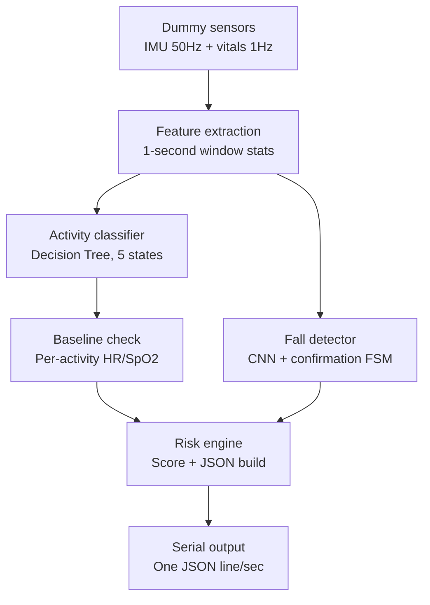

# Personal Health Telemetry & ESP32 Edge-AI System

A wearable health-telemetry and edge-AI pipeline for ESP32 (QMI8658 IMU + MAX30102 PPG).

**What it does:**
- ❤️ Detects heart-rate and SpO₂ anomalies against a personal, per-activity baseline
- 🚶 Classifies activity (Resting / Inactive / Walking / Running / Transition) via a Decision Tree
- ⚠️ Detects falls on-device using a quantized 1D CNN (TFLite Micro) with a post-fall confirmation state machine
- 📊 Combines everything into an explainable risk score, output as structured JSON once per second

---

## 🛠 Tech at a glance

| Layer | Tooling |
|---|---|
| Data generation & training | Python (numpy, scikit-learn, TensorFlow) |
| Firmware | C++ (Arduino framework via PlatformIO), TFLite Micro |
| Target hardware | ESP32-WROOM class boards |

---

## Pipeline

Runs once per second, fully on-device:



1. **Sensors** — 50Hz IMU (accel+gyro), 1Hz vitals (HR+SpO₂). Synthetic now (`dummy_sensor.h`); swap for real I2C reads later, no downstream changes needed.
2. **Feature extraction** — each 1s IMU window collapses to 6 numbers (magnitude mean/variance/peak, movement intensity) for the Decision Tree.
3. **Activity classifier** — Decision Tree (compiled to C `if/else`) labels Resting/Inactive/Walking/Running/Transition with a confidence score.
4. **Fall detector** — CNN runs on the raw 50Hz window (needs the actual sequence, not collapsed stats). A confirmation FSM requires ~3s of post-impact stillness before flagging, to reject jumps/drops.
5. **Baseline check** — HR/SpO₂ compared to a personal baseline *per current activity*, at two timescales (fast for spikes, slow for drift).
6. **Risk engine** — combines anomaly + fall flags into a 0–100 score with reasons.
7. **Serial output** — snapshot serializes to JSON (ArduinoJson), prints over USB.

## Why these three models

Each task got the cheapest model that fits its structure — not the most sophisticated one available.

| Task | Model | Why it fits | Rejected alternatives |
|---|---|---|---|
| HR/SpO₂ anomaly | Rule-based, dual-timescale baseline | Personal deviation detection; ~16B RAM, explainable z-scores, no cold-start data needed | PCA/Mahalanobis, Autoencoder — need a "normal" data corpus first, opaque output |
| Activity classification | Decision Tree | Nonlinear but simple boundaries; <1KB flash, <1ms inference, auditable branches | Logistic Regression, MLP — no accuracy gain for the added cost/opacity |
| Fall detection | Tiny 1D CNN (INT8) | Only task needing temporal pattern — sequence order (dip → spike → stillness) is the signal | Threshold rule, Decision Tree on stats — miss event order, false-positive prone |
| Excluded | — | — | Mahalanobis, full Autoencoder, general MLP — none fit any task better, all cost more RAM/flash |

### Resource footprint

| Component | RAM | Flash | Inference |
|---|---|---|---|
| Rule-based baseline (×2 metrics ×5 activities ×2 timescales) | ~160B | negligible | none (O(1)) |
| Decision Tree | 0 (stack only) | <1KB | <1ms |
| 1D CNN, INT8, TFLite Micro | tens of KB (≈96KB w/ full runtime on real hardware) | ~8KB model + ~40KB runtime | a few ms |

Measured on real ESP32-WROOM (320KB RAM): full pipeline used **29.4% RAM, 40.2% flash**.

---

## Repository structure

```
data_generation/
  generate_dummy_data.py   Synthetic IMU (50Hz) + vitals (1Hz) generator: activities,
                            transitions, falls, hard-negatives (drop/sit/jump/gesture)

training/
  train_decision_tree.py   Extracts features, trains activity Decision Tree,
                            exports compiled C comparisons (activity_tree.h)
  train_cnn.py              Trains CNN fall detector, quantizes INT8, exports TFLite
                            Micro C array + norm constants. Stratified train/test split.
  requirements.txt          numpy, pandas, scikit-learn, tensorflow-cpu

firmware/                   PlatformIO project, any ESP32-WROOM class board
  platformio.ini             Build config (Arduino, TFLite Micro, ArduinoJson)
  include/config.h           All tunable thresholds/constants
  include/dummy_sensor.h     On-device synthetic sensor generator
  include/motion_gate.h      Rejects PPG samples during high-motion windows
  include/baseline.h         Dual-timescale Welford/EMA personal baseline
  include/fall_detector.h    TFLite Micro CNN wrapper + confirmation FSM
  include/risk_engine.h      Risk score + JSON schema
  include/activity_tree.h    Generated (checked in from a demo run)
  include/fall_model_data.h  Generated (checked in from a demo run)
  include/fall_model_norm.h  Generated — CNN input normalization constants
  src/baseline.cpp           Baseline engine
  src/fall_detector.cpp      CNN inference + confirmation FSM
  src/risk_engine.cpp        JSON serialization (ArduinoJson)
  src/main.cpp               Wires the 50Hz/1Hz pipeline together

models/                     Regenerated activity_tree.h / fall_model_* land here
data/                       Generated CSVs land here (gitignored)
```

## Quick start

### 1. Generate data and train

```bash
cd training
pip install -r requirements.txt   # TensorFlow needs Python 3.9-3.12; use a venv if
                                   # your system Python is newer (3.13/3.14 lack TF wheels)
python ../data_generation/generate_dummy_data.py --minutes 3000 --seed 21 --out ../data
python train_decision_tree.py --imu ../data/imu_50hz.csv --out ../models
python train_cnn.py --imu ../data/imu_50hz.csv --out ../models --epochs 25
```

`--minutes 3000` targets ~50+ Fall segments (falls are ~3% chance per state transition by design). Check the printed `Train falls: X  Test falls: Y`; regenerate with more minutes if `Y` is under ~5.

```bash
cp ../models/activity_tree.h ../models/fall_model_data.h ../models/fall_model_norm.h ../firmware/include/
```

(Repo ships with headers from a prior run, so `firmware/` builds out of the box — overwrite anytime for a fresh model.)

### 2. Build and flash

```bash
cd firmware
pio run
pio run -t upload
pio device monitor -b 115200
```

Boots into dummy-sensor mode, prints one JSON line/sec:
```json
{"user_id":"user_001","summary":{"avg_hr":68.06,"avg_spo2":98.08},"activity":{"state":"resting","confidence":1},"anomalies":{"heart_rate":false,"spo2":false,"trend":false},"fall_detection":{"detected":false},"risk":{"score":0,"level":"low"},"reasons":[]}
```


## Notes

- `firmware/` targets generic `esp32dev` in `platformio.ini` — change `board =` for your hardware. Real test hardware reported 320KB RAM (not all ESP32-WROOM variants have 520KB); check your own `pio run` output.
- `TENSOR_ARENA_SIZE` in `config.h` (60KB) is a starting estimate — measure real usage via `interpreter->arena_used_bytes()` and adjust.
- The activity name lookup in `main.cpp` assumes the checked-in `activity_tree.h`'s enum order. Verify it after retraining with a different label set.
